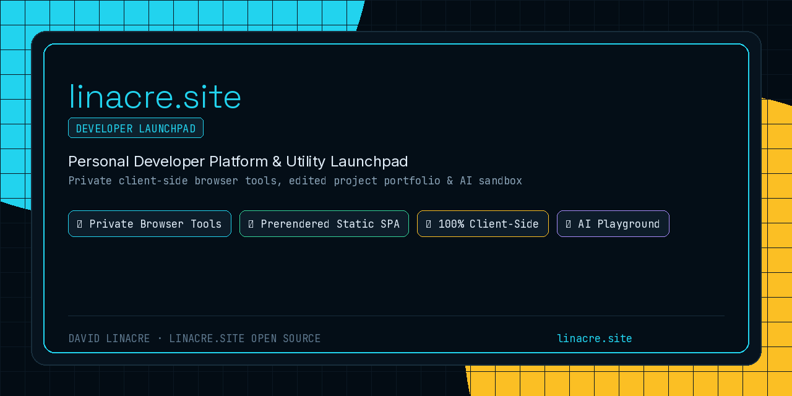

# Hi, I'm David Linacre 👋
### Self-Taught Software Developer · UK (Barnsley, South Yorkshire)

I build practical web applications, client-side tools, Android utilities, and local-first experiences.

🌐 **Main Portfolio & Live Launchpad**: [https://www.linacre.site](https://www.linacre.site)

---

## 🚀 Featured Public Projects & Live Apps

- 🐱 **[Fleatment](https://dlinacre.github.io/Fleatment/)** — UK Cat Flea & Tick Treatment Finder, Live Price Index & Safety Guide.
- 🤖 **[Personal OP Agent](https://www.linacre.site/tools/opagent.html)** — Zero-setup client-side AI workspace & prompt controller.
- 🛡️ **[Arena Audit](https://dlinacre.github.io/a-audit/)** — Universal browser audit checklist & prompt builder.
- 🎴 **[PokeGuru](https://lin4cre.github.io/PokeGuru/)** — Pokémon TCG database, UK GBP price trends & collection vault.
- 🛒 **[Apex POS](https://dlinacre.github.io/Apex-POS/)** — Offline-first point of sale system (Vue 3 + Dexie IndexedDB).
- 📱 **[Mob Deals](https://dlinacre.github.io/mob-deals/)** — Transparent UK SIM-only deal comparison tool.
- 🔋 **[DKMA Monster](https://lin4cre.github.io/dkma-monster/)** — Universal Android Dont-Kill-My-App OEM battery guide & GUI.
- 🎮 **[KushCloud](https://lin4cre.github.io/KushCloud/)** — Chill one-tap arcade flyer with synthesised Web Audio.

---

## 🛠️ Stack & Expertise
- **Frontend & Web**: React, TypeScript, Vue 3, Vite, Tailwind CSS, Canvas 2D, PWA
- **Systems & Automation**: Python, Node.js, FastAPI, Docker, GitHub Actions
- **Mobile & Local-First**: Kotlin, Android SDK, Dexie / IndexedDB, Web Audio

---

📬 **Contact**: davidlinacre@hotmail.co.uk | [www.linacre.site](https://www.linacre.site)
