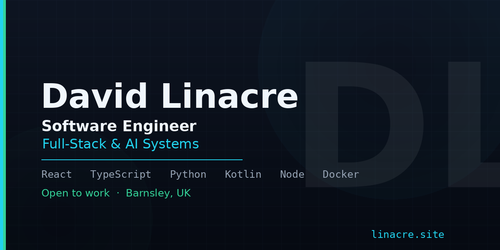

<div align="center">

# Hi, I'm David Linacre 👋
### Self-Taught Software Developer · United Kingdom (Barnsley, South Yorkshire)

[](https://www.linacre.site)
[](https://github.com/LIN4CRE)
[](mailto:davidlinacre@hotmail.co.uk)

I build practical web apps, high-performance canvas games, client-side tools, Android utilities, and local-first experiences. This account is my **experiments, R&D sandbox & architecture lab** — finished, polished work ships from **[@LIN4CRE](https://github.com/LIN4CRE)**.

---

### ⚡ Premier Featured Release
## [🚀 PIXEL HEIST — Tactical Stealth-Action Puzzle Game](https://dlinacre.github.io/pixel-heist/)
> **Next.js 15 • Phaser 3 • TypeScript • React 19 • Tailwind CSS • Drizzle ORM • Web Audio API**

<a href="https://dlinacre.github.io/pixel-heist/">
  
</a>
<a href="https://github.com/DLinacre/pixel-heist/blob/main/docs/01-PRD.md">
  
</a>

* **60 FPS Modular Monolith**: High-performance HTML5 Canvas stealth infiltration engine with procedural level generation.
* **4-State Guard AI & FoV Raycasting**: Guard patrol loops (`PATROL` → `SUSPICIOUS` → `ALERT` → `CHASE`) with real-time polygon line-of-sight raycasting against walls.
* **Interactive React Minigames & Gadgets**: Cylinder-pin lockpicking overlay, EMP Blasts, Acoustic Decoys, Smoke Bombs, and Speed Sneakers.
* **HMAC-SHA256 Anti-Cheat**: Cryptographically verified leaderboard score submissions with deterministic stealth multiplier math (`3.00x` S-Rank).

---

## 📌 Pinned Projects & Engineering Labs

<table>
<tbody>
<tr>
<td><a href="https://github.com/DLinacre/pixel-heist"></a></td>
<td><a href="https://github.com/DLinacre/Apex-POS"></a></td>
</tr>
<tr>
<td><a href="https://github.com/DLinacre/linacre-global-monitor"></a></td>
<td><a href="https://github.com/DLinacre/sim-root"></a></td>
</tr>
<tr>
<td><a href="https://github.com/DLinacre/Deasy"></a></td>
<td><a href="https://github.com/DLinacre/Linacre-LLM-Benchmarks"></a></td>
</tr>
</tbody>
</table>

---

## 🗂️ Complete R&D & Experiment Directory

### 🎮 Web Games & High-Performance Canvas
* **[🚀 Pixel Heist](https://github.com/DLinacre/pixel-heist)** — Tactical stealth-action puzzle webapp: procedural levels, 4-state Guard AI, lockpicking modal & HMAC-SHA256 leaderboards *(Next.js 15, Phaser 3, TypeScript)*.

### 💳 Local-First & POS Web Applications
* **[💳 Apex-POS](https://github.com/DLinacre/Apex-POS)** — Offline-first point of sale: register, inventory, customers, expenses, NFC, receipts & reports *(Vue 3 + Dexie, 100% client-side)*.
* **[🍽️ nic-food-decider](https://github.com/DLinacre/nic-food-decider)** — One-click decision engine for meals: weighted choices, dietary filters, and decision history *(Python / Vercel)*.

### 📡 Situational Awareness & Data Intelligence
* **[📡 linacre-global-monitor](https://github.com/DLinacre/linacre-global-monitor)** — Real-time geopolitical and environmental situational awareness dashboard *(NASA, USGS, Open-Meteo)*.
* **[📊 Linacre-LLM-Benchmarks](https://github.com/DLinacre/Linacre-LLM-Benchmarks)** — Automated 24h LLM benchmark dashboard with Windows EXE + Android APK super-app packaging.
* **[🐱 Fleatment](https://github.com/DLinacre/Fleatment)** — UK cat flea & tick treatment finder: live price index, active-ingredient matrix & veterinary safety toolkit.
* **[📱 Mob Deals](https://github.com/DLinacre/mob-deals)** — Transparent, accessibility-first UK SIM-only deal comparison tool with SEO metadata.
* **[🛒 PayHip-Scraper](https://github.com/DLinacre/PayHip-Scraper)** — Digital product intelligence for Payhip: live marketplace scraping, deterministic scoring & AI prompt generation.

### 🛠️ Systems, OS Tooling & Android
* **[🧠 SIM://ROOT](https://github.com/DLinacre/sim-root)** — The hacker's field guide to your SIM card: anatomy, pinout intel, and a 100% client-side digital infiltration lab.
* **[🛠️ Deasy](https://github.com/DLinacre/Deasy)** — Multi-platform branch orchestrator & Windows desktop suite: serverless pipelines, AES-256-GCM Drive backups, NSIS zero-terminal installers.
* **[📱 APKHub](https://github.com/DLinacre/APKHub)** — Curated Android APK intelligence, build artifact manager, and automated inspection toolkit.
* **[⚡ OmniRoute-LLM](https://github.com/DLinacre/OmniRoute-LLM)** — LLM routing layer for Android builds: model selection, fallback, and cost-aware dispatch.

### 🤖 AI & Prompt Engineering
* **[🤖 Grumpy Guy AI](https://github.com/DLinacre/grumpy-guy-ai)** — Opinionated, character-driven LLM assistant with personality-biased prompt engineering.
* **[🃏 PokéFlip AI](https://github.com/DLinacre/Pok-Flip-AI)** — Intelligent collectible card pricing index, condition analyzer, and market prediction engine.

### 🌐 Full-Stack Collaboration & Portfolios
* **[📊 Prism](https://github.com/DLinacre/prism)** — Premium project intelligence & team collaboration platform *(React + Express + SQLite, kanban, analytics)*.
* **[🌐 linacre.site](https://github.com/DLinacre/linacre.site)** — Personal software engineering portfolio, project showcase, and technical blog.
* **[🔍 a-audit](https://github.com/DLinacre/a-audit)** — Automated site audit (a11y, metadata, perf, content) rendered as a static GitHub Pages report.
* **[📄 MDT-kit](https://github.com/DLinacre/MDT-kit)** — MTD-Ready 2026 Filing Kit & Landing Page.

---

## 🛠️ Tech Stack & Architecture Profile

```
+-----------------------------------------------------------------------------------+
|                            TECHNICAL SKILLS & TOOLING                             |
|                                                                                   |
|  [ Frontend & UI ]    React 19 • Next.js 15 • Vue 3 • TypeScript • Tailwind CSS    |
|  [ Game & Canvas ]    Phaser 3.80+ • Web Audio API • Arcade Physics • Raycasting  |
|  [ Backend & Data ]   Node.js • Python • Express • Drizzle ORM • SQLite • Dexie  |
|  [ DevOps & Tools ]   Docker • GitHub Actions • CI/CD • NSIS • Vercel • Pages    |
+-----------------------------------------------------------------------------------+
```

---

## 📊 GitHub Analytics

<table>
  <tbody>
    <tr>
      <td></td>
      <td></td>
    </tr>
  </tbody>
</table>

</div>
